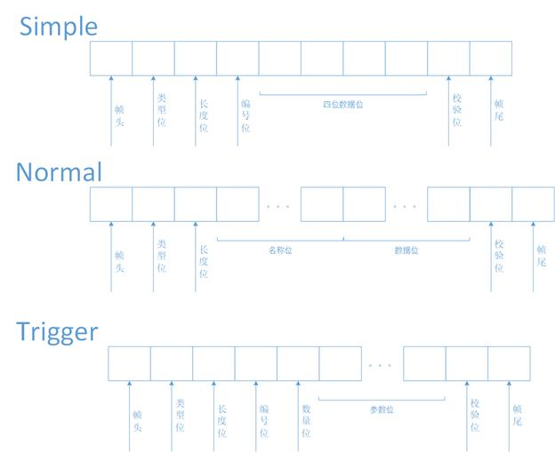
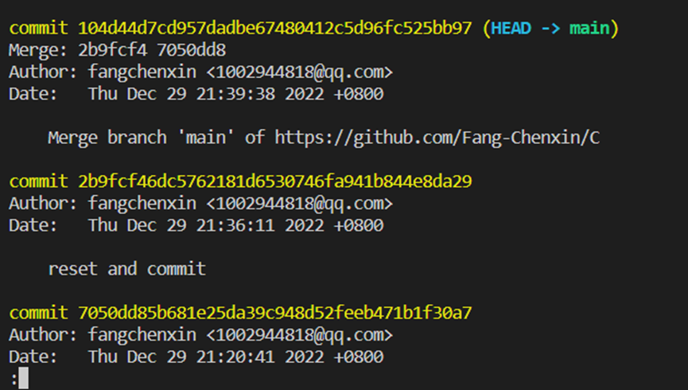
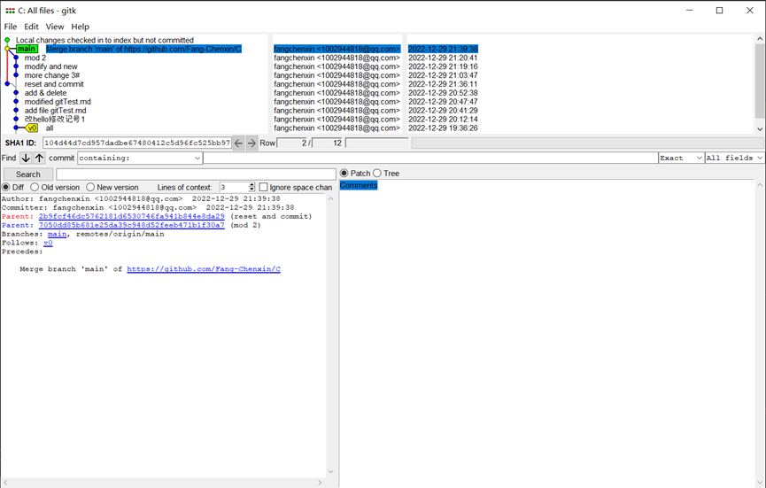
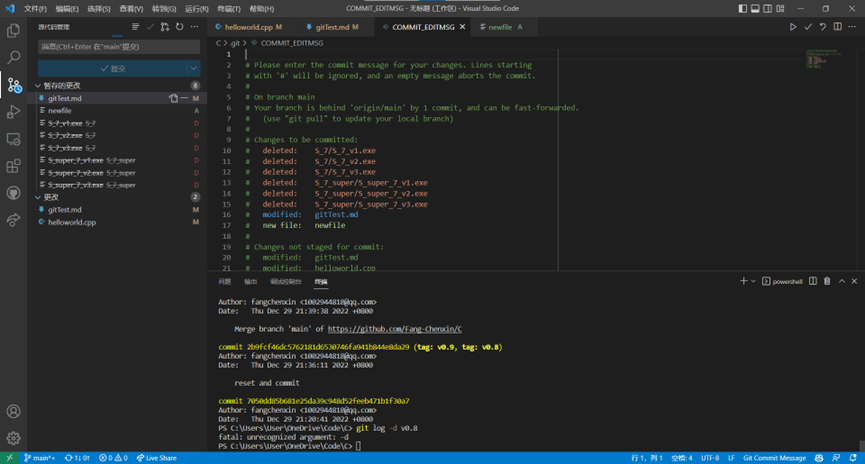
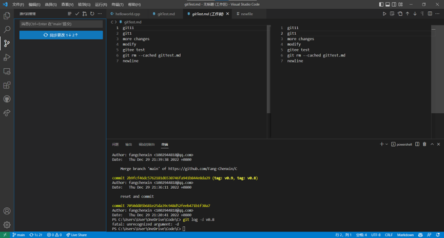

<<<<<<< HEAD
# 2023暑假控制组单片机方向线上测试

## 第一周测试题

### 1.git基本操作

#### 任务简介

> Git是一个开源的分布式版本控制系统，用于敏捷高效地处理任何或小或大的项目,可以帮助你进行自动的版本管理。控制组单片机端**之后的线上测试都是通过`gitee`发布**，在多人协作的情况下，使用`git`就会相当的方便，能够有效地协调多位开发者对不同地方的改动。

#### 任务要求

- 安装git，并且注册好`gitee`账户与`git`绑定，并且点击[**邀请链接**](https://gitee.com/buaarobot_admin/ControlGroupOnlineTest2023/invite_link?invite=553d41c7e8792713ac91e7f37729ef49e3fd9a65794fff84e511b1509403e86ec49ac7117559b8db427a56d8f320fd28)加入本远程仓库
- 注意邀请链接的有效期为3天
- 在想要克隆本仓库的地方，右键菜单点击“**`Git Bash Here`**”，输入以下代码，即可实现将远程仓库克隆到本地的操作，注意**之后的任务会放置在任务文件夹中**

```c
>>> git clone https://gitee.com/buaarobot_admin/ControlGroupOnlineTest2023.git
```

- 创建一个markdown文件，命名格式为**{你的名字}.md**，如`李明.md`  撰写你对本周题目的难度的看法，创建一个简述自己对**git组成以及常见命令使用原理的理解**的markdown文件，命名格式为 **{你的名字ToMarkDown}.md** ，如`李明ToMarkDown.md`。  
  两个文件统一放到`ControlGroupSCMOnlineTest2023/第一周测试题/task1`下面  
- `git commit -m {改动的内容}` 在这里写清这次提交改动的内容:**{你的名字}提交task1**   
- 本任务结果提交方式为<font color='black'>**git提交**</font>   

##### 提示信息

- 可以使用`git push` 将本地所有未上传的提交推送到远程仓库
- 此时有可能会提示推送失败，这是因为远程仓库里面有本地未获取的提交
- 此时需要先`git pull`获取当前远程仓库的最新版本， 将远程仓库的最新版本和本地最新版本合并(`merge`)后，才能够推送 
- 第一次进行提交操作时需要登记提交者信息，提交时`git`会有相关的操作说明
- 更多详细的`git`用法请查询参考资料或借助网络搜索  

##### 注意

<font color="black" size=3>**不是**所有任务都需要利用git进行提交，第一周以及以后的其它任务提交方式**请以对应的任务说明为准**</font>

#### 参考资料

- [<u>git入门教程</u>](https://www.cnblogs.com/imyalost/p/8762522.html)
- [菜鸟教程yyds](https://www.runoob.com/git/git-tutorial.html)
- 一个可以打开md文件的软件：[Typora](https://bhpan.buaa.edu.cn:443/link/5D15F20C387C3E8D482B1A2AF01EC387)

### 2.PID控制程序编写及封装

#### 任务简介

> PID算法是控制领域应用最广泛的算法，其计算流程与其应用场景并无关系，为了避免重复编写同样的代码，我们往往会将PID算法进行封装，初始化过后直接调用即可。

#### 任务说明

1.请完善`PID.c`中的两个空白函数，函数的功能已经在注释中写出。

`void PID_StructInit(PID_t *pid, float p, float i, float d, float integral_limit, float max_output)`

`static void Calculate(PID_t *pid, float current_value, float target_value)`

2.请根据自己编写好的函数进行对`PID.c`的封装。
    需要达到的**要求**是用户在定义 `PID_t` 结构体后(例如 `PID_t TestPID`)，先运行`PID_StructInit`函数，再使用`TestPID.f_Calculate(&TestPID, Current_value, Target_value)`即可完成计算，计算的结果保存在结构体中。

3.通过查阅关于`PID`的资料，说一说P、I、D三个参数分别有什么作用，如果让你调节PID参数，你会如何开始调节。写成一个`.md`文档，字数不超过100字，以自己的名字命名即可。

4.本任务的代码均放在 `第一周测试题/task2`文件夹下。

#### 任务要求

- 需要提交的文件：`PID.c`和`PID.h`和`PID参数说明文档`。
- 程序有一定可读性，包含适当的注释；**即使没能完成任务，也请提交上来**，并且在同目录下创建一个README文本文件中写明原因以及完成的进度情况。
- 本任务提交方式为<font color='black'>**邮箱提交**</font>，邮箱为`bhjqrdkzz2022@163.com`(与其他需要邮箱提交的任务放在**同一个zip文件**中，zip文件命名格式为 **{你的名字}第一周测试题.zip** )
- 提交的文件放在`/task2`文件夹下

#### 参考资料

- [初识PID-搞懂PID概念](https://zhuanlan.zhihu.com/p/74131690)

### 3. 简单帧

#### 任务简介

> 通信协议是指在通信过程中双方遵循的规则和约定，包括数据格式、传输方式、错误处理等内容。没有通信协议，通信双方无法理解对方发送的信息，也无法进行正确的数据传输和处理。因此，通信协议是通信过程中必不可少的一部分。

#### 任务说明

1. 在机器人队遥控器与下位机STM32F407之间的通信协议中规定了三种数据帧，由起始位、帧类型、数据位和校验位等组成，示意图如下所示：



Simple帧是三种数据帧最简单的一种帧，其作用是修改远端指定编号变量的值，其每一位参数如下：

- 帧头：0x7E
- 类型位：0x00（可以此判断为简单帧）
- 长度位：0x05（编号位和数据位的总长度）
- 编号位：本题中为0x01或0x02
- 数据位：

  - size:4

  - type:本题中为float或int型(4字节数据类型)
  - **小端模式**
- 校验位：一字节，通过校验和计算获得
  - 计算方法：把从类型位到数据位之间的位全部求和，求和值舍弃溢出的高位
- 帧尾：0x30

2. 简单帧发送

假设在本次调试过程中，需要修改远端两个变量（编号1变量：float型；编号2变量：int型），请完善`void SendSimpleFrame(uint8_t id, ...)`函数。

3. 简单帧接收

当接收到一帧后，需要调用接收处理函数读取其中包含的信息。在简单帧接收处理函数`void SimpleFrameHandler(uint8_t *recv_frame, uint16_t len)`中，需要完成以下任务，请以此完善该函数：

- 判断是否为完整的一帧
- 重新计算校验值，判断有无接收错误
- 判断帧的长度是否正确
- 若前项均正确，根据编号位的值正确读出数据位的值

4. 本任务的代码放在 `第一周测试题/task3`文件夹下。

##### 任务提示

- 由于发送数据的类型不确定，发送函数需要使用可变参数，具体实现可以参考以下资料。
- 注意，`int`和`float`型变量为4字节，而一般的通信过程都需要将其拆分为单字节进行传送。int型的转换较简单，通过移位操作（>>）即可实现，float型不建议通过转换为int的方法发送，这样会损失精度，具体实现可以参考以下资料。

#### 任务要求

- 需提交`frame.c`文件
- 程序有一定可读性，包含适当的注释；**即使没能完成任务，也请提交上来**，并且在同目录下创建一个README文件，在其中中写明原因以及完成的进度情况。
- 本任务提交方式为<font color='black'>**邮箱提交**</font>，邮箱为`bhjqrdkzz2022@163.com`(与其他需要邮箱提交的任务放在**同一个zip文件**中，zip文件命名格式为 **{你的名字}第一周测试题.zip** )
- 提交的文件放在`/task3`文件夹下

#### 参考资料

- [C语言可变函数参数 - 哔哩哔哩](https://www.bilibili.com/read/cv20412768)

- [技术分享 | float类型与uint8数组的相互转换-CSDN博客](https://blog.csdn.net/msq19895070/article/details/122876298)

- [关于C ++:将*float转换为*4 *uint8_t* | 码农家园](https://www.codenong.com/25386503/)

### 4.UDP通信

#### 任务简介

> Qt 是一个跨平台的 C++ 框架，可以用来开发Windows系统图形用户界面。北航机器人队的遥控器采用Qt开发，通过Wifi与下位机STM32F407之间建立连接，使用UDP（**User Datagram Protocol，用户数据报协议**）协议传输数据。

#### 任务说明

1. 利用Qt实现可以发送和接收UDP数据包的应用程序

2. **要求**

- **只**需要实现下述基本功能：设置远端ip，远端端口，本地端口，开始连接，断开连接，发送接收。
- 需要有发送框和接收框，点击发送将发送框中的内容发出，接收的内容显示在接收框中。
- （可选）实现简单帧通信

#### 任务要求

- 需提交完整的**QT工程文件**
- 程序有一定可读性，包含适当的注释；**即使没能完成任务，也请提交上来**，并且在同目录下创建一个README文本文件中写明原因以及完成的进度情况。
- 本任务提交方式为<font color='black'>**邮箱提交**</font>，邮箱为`bhjqrdkzz2022@163.com`(与其他需要邮箱提交的任务放在**同一个zip文件**中，zip文件命名格式为 **{你的名字}第一周测试题.zip** )
- 提交的文件放在`/task4`文件夹下

#### 参考资料

- [基于QT的UDP通信_qtudp通信](https://blog.csdn.net/weixin_43479242/article/details/126995697)
- [QT下载参考链接](http://c.biancheng.net/view/3851.html)
- [【Qt5】入门Qt开发教程](https://blog.csdn.net/qq_33904382/article/details/111369153)
- [C++总结（三）——类与对象](https://zhuanlan.zhihu.com/p/619050568)

=======
# 简介
Git是一个开源的分布式版本控制系统，用于敏捷高效地处理任何或小或大的项目。Git在全球范围被广泛使用，主要用于代码开发过程中的版本管理，Git每个版本所储存的是不同版本文件的修改内容，因此相比于备份保存各个版本可以节省很多空间，尤其是版本数量极多的情况下。自然地，作为版本控制系统，Git也可以方便地回退到之前的版本。Git基于修改内容的存储方法也使得Git可以显示出不同版本间内容的差异，快速找到团队中其他人修改的部分。Git还有分支功能，可以创建多个分支，分别由不同人负责开发各个功能模块，并在完成后合并各分支修改。

Git可以在本地建立一个版本管理仓库，也可以将这个仓库共享到远程服务器上，如Github、Gitee等平台，在云端保存代码或是将代码共享给更多人。Github是最大最热门的平台，但国内连接时可能会有一定的困难，而Gitee连接相对更为稳定。在云端保存代码时要注意不要使用amend、undo、redo之类修改历史记录的命令，防止同一版本不同人获取到的内容不一致，应当提交新一版以代替此类行为。
# 相关资料
以下为Git相关资料链接，视频仅供参考，可自行寻找其他介绍视频，在Git Bash、Vscode终端都使用Git命令行，操作基本一致，图形化界面对操作方式有较大改变，目前有多种Git图像化界面，可自行选择感兴趣的进行深入了解。

强烈建议阅读[菜鸟教程](https://www.runoob.com/git/git-tutorial.html)，其中列出了Git中常用的命令，并对于必要的概念做出了清晰解释。
推荐通过[Git闯关式学习](https://learngitbranching.js.org/?locale=zh_CN)熟悉Git操作，强化对版本树的概念理解。每关前都有带动画演示的说明，并且在关卡内练习指定操作，此教程对版本树变更做了可视化处理以便理解。教程内容覆盖除配置外的几乎所有常用命令。
为规范提交信息，请阅读[Git commit规范](https://www.conventionalcommits.org/zh-hans/v1.0.0/)。

Git 各平台安装包下载地址为：http://git-scm.com/downloads
*******************************************************************************
Git介绍视频（含github相关内容）：
Git Bash（Git自带的命令行方式）：[git、github 保姆级教程入门，工作和协作必备技术，github提交pr - pull request](https://www.bilibili.com/video/BV1s3411g7PS/?spm_id_from=trigger_reload&vd_source=a4e5f980d5f72ee9cf4a10444b1b5eda)
使用Vscode终端：[『教程』简单明了的Git入门](https://www.bilibili.com/video/BV1Cr4y1J7iQ/?spm_id_from=333.788.recommend_more_video.0&vd_source=a4e5f980d5f72ee9cf4a10444b1b5eda)
GitKraken图形化界面：[Git + GitHub 10分钟完全入门](https://www.bilibili.com/video/BV1KD4y1S7FL/?spm_id_from=333.337.search-card.all.click&vd_source=a4e5f980d5f72ee9cf4a10444b1b5eda)、[Git + GitHub 10分钟完全入门 (进阶)](https://www.bilibili.com/video/BV1hA411v7qX/?vd_source=a4e5f980d5f72ee9cf4a10444b1b5eda)
*******************************************************************************
Git中文参考文档：[Git 教程 | 菜鸟教程 (runoob.com)](https://www.runoob.com/git/git-tutorial.html)
Git闯关式学习（learn git branching）：https://learngitbranching.js.org/?locale=zh_CN
Git commit规范（约定式提交）：https://www.conventionalcommits.org/zh-hans/v1.0.0/
*******************************************************************************

# 全过程指南
此部分为整合的介绍，覆盖Git使用中的基本常用操作，但总体内容相对简单粗浅，仅作为基本了解性介绍。
Git操作使用VScode终端进行演示，大部分资料来源为上述链接，建议先通过以上资料了解Git。
涉及到的指令可以在[Git 基本操作 | 菜鸟教程 (runoob.com)](https://www.runoob.com/git/git-basic-operations.html)中找到具体用法和解释。
## 空间
Git管理的空间可以分为三部分，工作区、暂存区和版本库。
* 工作区：就是你在电脑里能看到的目录。
* 暂存区：英文叫 stage 或 index。一般存放在 .git 目录下的 index 文件（.git/index）中，所以我们把暂存区有时也叫作索引（index）。
* 版本库：工作区有一个隐藏目录 .git，这个不算工作区，而是 Git 的版本库。
## 建立本地仓库（git init）
```
git init    #建立本地仓库
```
使用Git首先要在本地创建一个代码仓库，选择文件夹目录后执行`$ git init`即可，完成后会创建一个名为".git"的文件夹（以.开头为隐藏文件夹，在文件管理器中显示选项卡下勾选显示隐藏的项目可见），无需关注此文件夹中内容，无法直接打开读取其中文件内容。
输入以下两条指令以设置用户名和邮箱，替换引号内文本为个人信息，Git不会检查信息的有效性，仅作为提交时的附带信息以便其他人联系修改者。若无`--global`则只对当前仓库有效。
```
$ git config --global user.name "your name"
$ git config --global user.email "your_email@youremail.com"
```
## 克隆远程仓库(git clone)
```
git clone [远程仓库地址] #将远程仓库克隆到本地
```
当远程仓库已存在时，不需在本地执行`$ git init`，而需要使用`$ git clone`命令。如其名，此命令的功能是将远程仓库的内容克隆到本地。当团队共同开发一个项目时，除了项目的创建者，其他人需要以此命令克隆项目，否则可能会因为本地和远程文件不一致而无法正常同步，不能执行`git fetch`、`git pull`、`git push`等命令，产生不必要的麻烦。
使用此命令下载Github、Gitee等网站上的项目时会下载“.git”文件夹从而保留版本修改信息，而下载zip压缩包时因不会下载“.git”文件夹，会丢失此部分信息。
## 提交文件
### 加入暂存区（git add、git status）
```
$ git add [文件名]    #添加指定文件更改到暂存区
$ git add .    #添加文件夹下所有文件更改到暂存区
```
当对一个文件执行`$ git add [文件名]`命令时，此文件更改将被加入暂存区，`$ git add .`可以将所有文件更改加入暂存区（未修改的无法加入）。使用`$ git status`命令可以查看暂存区中所有文件更改。
### 提交（git commit）
```
$ git commit    #通过vim编辑注解信息
$ git commit -m "注解信息"    #以消息方式快速提交
```
git commit命令可以将暂存区中文件移入版本库，并在当前分支下增加一条版本记录。命令行中直接输入`$ git commit`会打开一个vim编辑器页面，按a或i打开编辑模式，以“#”开头行的内容会被忽略，其余的为本次提交的注解信息（不能为空，否则不能提交），esc键退出编辑，按：输入保存方式，输入wq（保存并退出），回车确认完成提交。或者使用`$ git commit -m "注解信息"`以快速提交，m是message的缩写。
### 查看记录（git log、gitk）
```
$ git log    #查看所有提交记录
$ gitk    #打开图形化的查看窗口
```
可以通过`$ git log`命令查看所有记录，可以添加修饰以使得记录更简洁易懂或是翻转，具体参考[Git 查看提交历史 | 菜鸟教程 (runoob.com)](https://www.runoob.com/git/git-commit-history.html#git-log)，在命令行中黄字commit后长串的十六进制数字即为此版本的哈希值，可以唯一代表此版本，当需要操作此版本时可以使用此值代表，只需前四五位即可，无需全部完整数值。

当`$ git log`需显示的内容过多，无法在一屏内完全显示时可能会看到在底部有冒号出现，如下图所示。此时按回车可向下滚动一行，q退出，h显示帮助查看更多按键功能。此时若改变终端显示区域大小可能会出现故障无法正常响应，请避免此操作。

若不喜欢命令行的显示方式也可以通过`$ gitk`打开图形化的查看窗口，也可以考虑使用 SourceTree、Github Desktop、TortoiseGit 等Git图形化工具。此窗口中选中版本的哈希值显示在SHA1 ID框内。

## 版本树管理
### 标签（git tag）
```
$ git tag [标签名]    #为当前HEAD指向的提交记录打上标签
$ git tag [标签名] [哈希值]    #为指定版本补打标签
```
在任何时候输入`$ git tag [标签名]`将为最新提交记录打上标签（实际上是HEAD指针所指位置，通常指向当前分支最新版本），此后可以使用该标签名指代这一版本而不需使用哈希值，`$ git tag [标签名] [哈希值]`则可以为之前的某一版本补打标签，可以在git log中查看所需值，不需要输入完整的哈希值，只需输入一部分即可自动识别。添加“-a”修饰符可以为标签加注解，和`$ git commit`提交时一致。一个版本可以有不止一个标签。
### 分支（git branch、git checkout/git switch、git merge）
```
$ git branch [分支名]    #创建分支
$ git branch -d [分支名]    #删除分支
```
使用`$ git branch [分支名]`可以创建一个新分支，使用`$ git branch -d [分支名]`可以删除指定分支，Git 分支实际上是指向更改快照的指针。分支创建的位置为HEAD指针位置，在`$ git log`中可以看到HEAD指针的位置，一般会跟随最新版本，通过一些命令操作可以使HEAD指针与最新版本分离，进入分离HEAD模式，Git此时也会发出提示。HEAD指针是git操作默认的参考位置，在使用操作对象为某一特定版本的命令（如git tag）时若缺省指定版本的参数，则对HEAD指针所指的版本进行操作。
```
$ git checkout [分支名]    #切换分支
$ git switch [分支名]    #同上，建议使用这个
$ git merge [分支名]    #合并分支
```
切换分支命令:`$ git checkout [分支名]`，新版本git中可以使用git switch代替git checkout，checkout 命令具有分支的管理和文件的恢复两个核心功能，功能较多、不够准确。在 git 2.23 版本中新增了 switch 和 restore命令，用于替代 checkout 命令，进而分化 checkout 命令的职责。
此命令实际是改变HEAD指针所指位置，分支名可以用任一版本位置代替。当指向某一分支时，HEAD指针会和该分支合并，指向随着此分支变化而变化；当指向某一特定版本时则会进入分离HEAD模式，即使此版本是当前分支指向的位置。
利用分支可以实现多条路线同时开发，互不干扰，当分支开发完成时可以使用`$ git merge [分支名]`合并分支到当前分支上。
### 编辑版本树（git rebase、git cherry-pick）
```
$ git rebase [目标分支名]    #将当前分支移动到目标分支上
$ git rebase [目标分支名] [源分支名]    #将源分支移动到目标分支上
$ git cherry-pick [提交1] [提交2] [提交3] ...    #可填写更多提交，将指定提交按命令中顺序排列移动到当前分支下
```
这两个命令会改变版本数的形状，可能会导致提交到远程仓库时出现问题，可在本地使用，若涉及远程仓库需谨慎。
git rebase和git merge实现的功能相同，但会使两个分支合并成一条，改变已有的版本数。
git cherry-pick如其名，会像摘樱桃一样把提交从原有分支上摘下，按命令中顺序排列成串后连接在当前分支后。
可以在[Git闯关式学习](https://learngitbranching.js.org/?locale=zh_CN)中尝试这两个命令，观察版本树的变化。

## 文件更改
### 删除文件（git rm）
```
$ git rm [文件名]
```
在Git工作区中若要删除文件可以使用git rm命令。
Git添加了暂存区，要完成删除文件操作需要将此更改加入暂存区并提交到版本库。在文件夹中直接删除文件后删除文件的操作不会进入暂存区，此时使用`$ git status`会看到
```
Changes not staged for commit:
  (use "git add/rm <file>..." to update what will be committed)
  (use "git restore <file>..." to discard changes in working directory)
deleted:（被删除的文件）
```
此时可以按提示使用git add将删除文件加入暂存区，而使用git rm命令删除文件，此更改将直接进入暂存区，可根据习惯和便利程度选择删除文件的方式。
### 移动或重命名文件（git mv）
```
$ git mv [文件名] [新文件名]
```
在Git工作区中若要移动或重命名文件可以使用git mv命令，文件名中带路径即可指定文件位置。
git mv和git rm类似，操作完成后更改直接进入暂存区，不需额外使用git add。使用这两个命令可以避免在删除或移动文件后因文件夹列表发生变化而忽视了这一更改的情况发生，不过借助辅助工具，例如VScode的“源代码管理”页面可以直观地看到这些变化（后面有相关使用说明），只需在每次提交前记得将所需提交的更改都加入暂存区即可。

## 远程仓库
### 添加远程仓库（git remote add）
```
$ git remote add [远程仓库名] [地址]    #添加远程仓库
$ git remote    #查看已有的远程仓库，仅显示名字
$ git remote -v    #查看已有的远程仓库，带地址
```
使用git remote add可以添加远程仓库，仓库名默认origin，地址在Github、Gitee的仓库网页上获取。git remote可以查看已有的远程仓库，添加“-v”显示带地址的详细信息，v是verbose的缩写。
### 更改远程仓库（git remote rm、git remote rename）
```
$ git remote rm [远程仓库名]  # 删除远程仓库
$ git remote rename [原远程仓库名] [新远程仓库名]  # 修改仓库名
```
若输入错误或是想要修改仓库名可以使用以上两条指令。
### 提交到远程仓库（git push）
```
$ git push
$ git push [远程仓库名] [分支名]    #将指定分支提交到远程仓库
```
git push可以将本地版本库同步到远程仓库，同时会在本地更新origin/main分支（默认，可更改，也可能为origin/master），此分支即代表远程仓库同步的进度。在仓库中初次使用git push时，Git可能会给出如下提示，意为当前分支没有与远程分支关联，使用所给代码即可将当前分支（此处为master）与远程分支（此处为origin）关联，之后直接输入`git push`即可。
```
fatal: The current branch master has no upstream branch.
To push the current branch and set the remote as upstream, use
    git push --set-upstream origin master
```
当首次连接到远程仓库平台时需要进行账号验证，按提示操作完成登录才能进行提交。
当版本树存在冲突时无法提交，具体可参考[Git闯关式教程](https://learngitbranching.js.org/?locale=zh_CN)远程仓库相关内容。
### 从远程仓库同步（git fetch、git pull）
```
$ git fetch    #获取远程仓库更新
$ git pull    #git fetch + git merge
```
git fetch则是从远程仓库同步到本地版本库，通常是在多人协同使用此操作，当其他人向远程仓库提交更新之后，远程仓库和本地仓库不一致，则需要使用此指令获取更新，需要注意的是此命令不会改动本地分支指向，需要另行手动更新。若在上次同步后本地和远程仓库都有改动，则执行此命令后版本树会在上次同步的位置后分叉。
在使用`$ git fetch`命令后通常会接着使用`$ git merge`命令将远程仓库的改动合并到当前分支，`$ git pull`命令可以代替这两个命令，与`$ git fetch;$ git merge`等价。
进行远程仓库相关操作时版本树较为复杂多变，push、pull也有更灵活的使用方法，具体可参考[Git闯关式教程](https://learngitbranching.js.org/?locale=zh_CN)远程仓库相关内容。

## 版本回退
### 本地仓库（git reset）
```
$ git reset [指定版本]
```
若想要回退到之前的版本，可以使用git reset命令。指定版本的方式可以是HEAD指针、分支名、哈希值、标签名、相对引用。
相对引用方式中可以使用其他几种方式指定一个参考位置，并加上“\^”代表上一个版本或“~”加数字表示前进几个版本（如 “~2”，代表前两个版本），要注意“\^”加数字表示版本数存在多个分支时选中第几个父节点而非前几个版本（如“\^2”，表示第二个父节点），当使用合并分支后就会出现一个节点存在多个父节点的情况。
当使用git reset后，所回退版本之后的版本会消失，导致版本树发生变化。
git reset有mix、soft、hard三种模式，不输入参数默认mix，具体可参考[Git Reset 三种模式](https://www.jianshu.com/p/c2ec5f06cf1a)。
### 远程仓库（git revert）
```
$ git revert [指定版本]
```
对于远程仓库则不能使用git reset命令，因为它会改动已有的版本树，应使用git revert代替，使用方法与git reset一致，但它会在最后追加一个新的提交代替git reset直接修改版本树的操作，这样这一修改也能推送给其它人。

## 在VScode中使用Git
### 实时显示修改
对于进行了Git初始化的文件夹，VScode会实时显示当前工作区中文件较版本库中最新版本的变化，无需ctrl+s保存即可显示，跟随编辑实时更新，类似git diff功能，但更加直观。下图中标记依次为删除行、修改行、新行。当更改加入暂存区后不再显示。

### 自动标记已修改文件
当前打开文件夹下的所有文件的修改状态也会在“资源管理器”中以文件名颜色和字母符号进行标记。但需注意必须按ctrl+s保存后才会在“资源管理器”中显示标记，并出现在“源代码管理”页面中。U代表未跟踪，即版本库中和暂存区中都没有任何此文件的记录，A表示添加，版本库中没有但在暂存区中，M代表修改，D代表删除（显然无法“资源管理器”中出现，只出现在“源代码管理”中）。

### 源代码管理页面
“源代码管理”是VScode对于Git提交提供的图形化操作界面，可以方便地管理在暂存区中的文件，所有更改过的文件都会出现在此界面中的“更改”栏下，在此页面可以快捷地将文件加入或拉出暂存区，“暂存的更改”栏下即为暂存区中的内容，可以使用`$ git status`进行验证。此页面点击提交相当于`$ git commit`但注意会在右侧文本编辑区打开一个文本文件而非在终端以vim方式显示，同样不能为空，输入注解文本并保存后关闭此页面完成提交。也可以在“提交”上方的“消息”框中先填入文本再点击“提交”，相当于`$ git commit -m "注解信息"`。点击“提交”右侧下拉箭头，除“提交”外还有“提交和推送”“提交和同步”，相当于`$ git commit`之后执行`$ git push`或`$ git pull`。此外也需注意此方式默认连接远程仓库origin/main（远程仓库默认名），若修改了名字或要提交到其他仓库其他分支则要另外进行设置。


若本地所有修改都已提交且设置了远程服务器Git仓库，“提交”按钮会变为“同步更改”，并显示推送和同步的数量，若提示存在冲突可选择进入此时提供的“合并编辑器”选项手动解决冲突，修改文件为所需的样子。
 
>>>>>>> 27a65c73646bd4f947988ade093f55aa647dd40e
